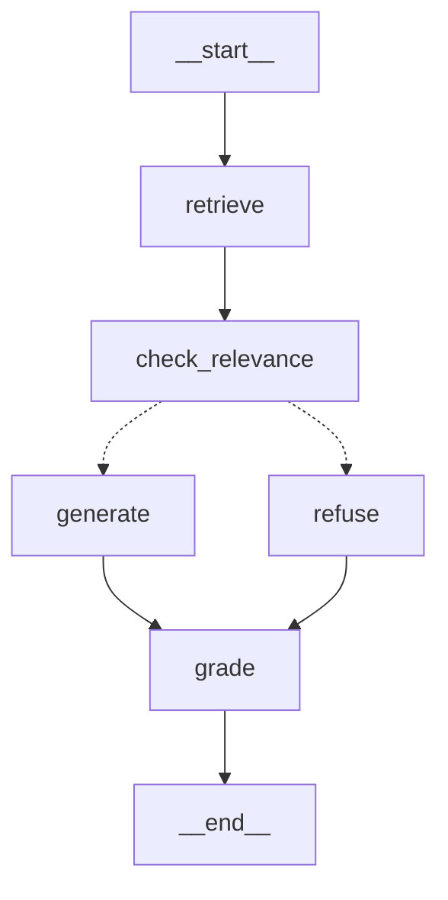

# Agentic AI eBook — RAG Chatbot

> Ask questions about Konverge AI's eBook **"Agentic AI: An Executive's Guide"** and get answers
> that come *only* from the book — with page citations, the retrieved evidence, and two honest
> scores. If the book doesn't answer it, the bot says so.

    

**Stack:** Python · LangGraph · Pinecone (vector DB + hosted embeddings) · Groq LLM · FastAPI
**Knowledge base:** [Ebook-Agentic-AI.pdf](https://konverge.ai/pdf/Ebook-Agentic-AI.pdf) (60 pages → 143 chunks)
**Keys needed:** two — `PINECONE_API_KEY`, `GROQ_API_KEY` (both have free tiers)

---

## Table of contents

1. [Quick start](#1-quick-start)
2. [What it does](#2-what-it-does)
3. [Architecture](#3-architecture)
4. [Request lifecycle](#4-request-lifecycle)
5. [Project structure](#5-project-structure)
6. [Setup & installation](#6-setup--installation)
7. [Environment variables](#7-environment-variables)
8. [Ingesting the PDF](#8-ingesting-the-pdf)
9. [Running the API](#9-running-the-api)
10. [API reference & examples](#10-api-reference--examples)
11. [Sample queries](#11-sample-queries)
12. [Testing](#12-testing)
13. [Design decisions](#13-design-decisions)
14. [Assignment checklist](#14-assignment-checklist)
15. [Troubleshooting](#15-troubleshooting)
16. [Production roadmap](#16-production-roadmap)

---

## 1. Quick start

```bash
git clone https://github.com/shreyajaiswal24/Agentic_AI-RAG-chatbot.git && cd Agentic_AI-RAG-chatbot
python -m venv .venv && source .venv/bin/activate      # Windows: .venv\Scripts\activate
pip install -r requirements.txt
cp .env.example .env                                   # add PINECONE_API_KEY and GROQ_API_KEY
python -m scripts.ingest                               # ~30 s: download → clean → chunk → embed → index
uvicorn app.main:app --port 8000                       # open http://localhost:8000
```

Then ask something:

```bash
curl -s localhost:8000/ask -H 'Content-Type: application/json' \
     -d '{"question": "What are the core pillars of an Agentic AI system?"}' | jq .answer
# "The core pillars are Perception, Reasoning, Planning, Learning, and Execution (Page 17; Page 19)."
```

---

## 2. What it does

| Capability | How |
|---|---|
| **Answers only from the PDF** | The LLM sees nothing but retrieved excerpts, is told to refuse otherwise, and is fact-checked afterwards |
| **Refuses off-topic questions** | A similarity gate routes low-relevance questions to a fixed refusal — the LLM is never called |
| **Cites pages** | Every chunk carries its page number; the model cites `(Page N)` and the API returns the chunks |
| **Two honest scores** | `relevance_score` = retrieval similarity (cosine); `confidence` = fraction of answer claims a second LLM pass found supported by the excerpts |
| **Browser chat + JSON API** | `GET /` serves a small chat page; `POST /ask` is the API; `GET /docs` is the OpenAPI UI |
| **Provider-swappable** | Groq ⇄ OpenAI for the LLM, Pinecone-hosted ⇄ OpenAI for embeddings, via env vars |

---

## 3. Architecture

Two independent pipelines share one Pinecone index. Ingestion runs once, offline; the API only reads.

```
   OFFLINE  ·  python -m scripts.ingest                 ONLINE  ·  POST /ask
   ─────────────────────────────────────                ────────────────────────────────────────
   PDF (60 pages)                                        question
     │  loader.py      pypdf → one Page per PDF page        │
     ▼                                                      ▼
   cleaner.py    strip running headers, page numbers,   ┌─ LangGraph ─────────────────────────────┐
     │           fix bullet glyphs, normalise spaces     │  retrieve                               │
     ▼                                                   │    embed question ("query" mode)        │
   chunker.py    800 chars / 150 overlap, page-aware     │    Pinecone top-5 by cosine             │
     │           → 143 chunks  p019-c00 …                │      │                                  │
     ▼                                                   │  check_relevance                        │
   embeddings.py llama-text-embed-v2 ("passage" mode)    │    best score ≥ 0.25 ?                  │
     │                                                   │     yes ──────────────┐  no             │
     ▼                                                   │      ▼                ▼                 │
   vector_store.py  index.documents.upsert               │  generate           refuse              │
     │  {_id, embedding, text, page, chunk_index, src}   │   Groq LLM,          fixed message,     │
     ▼                                                   │   strict prompt      no LLM call        │
   ┌────────────────────────────┐                        │      └───────┬────────┘                 │
   │  Pinecone serverless index │ ◄──────────────────────│  grade  (2nd LLM pass fact-checks       │
   │  agentic-ai-ebook/ebook-v1 │        search          │          answer vs excerpts; skipped    │
   └────────────────────────────┘                        │          when nothing was generated)    │
                                                         └─────────────────┬───────────────────────┘
                                                                           ▼
                                                     { answer, grounded, route, relevance_score,
                                                       confidence{score, level, verdict, reason},
                                                       retrieved_chunks[{chunk_id, page, score, text}] }
```

The graph exactly as LangGraph renders it (`graph.get_graph().draw_mermaid()`; dotted = conditional edge):



| Node | Does | Calls an LLM? |
|---|---|---|
| `retrieve` | Embeds the question, fetches top-k chunks + metadata from Pinecone | no |
| `check_relevance` | `relevance_score = max(chunk scores)`; picks `generate` or `refuse` | no |
| `generate` | Answers from the excerpts under a strict grounding prompt; detects the refusal sentence → `grounded` | yes |
| `refuse` | Returns the fixed "not in the knowledge base" message | no |
| `grade` | Fact-checks the answer claim-by-claim against the excerpts → `confidence` | yes (skipped if no answer) |

---

## 4. Request lifecycle

What happens for `POST /ask {"question": "Tell me about agents."}`:

1. **Validate** — Pydantic checks `question` is 3–1000 characters (`api/schemas.py`).
2. **retrieve** — the question is embedded with `input_type="query"` and Pinecone returns the 5 nearest chunks with their `page`, `chunk_id`, `text`, and cosine `score`.
3. **check_relevance** — best score is 0.344 ≥ 0.25 → `route = "generate"`. (For "What is the capital of France?" the best score is 0.05 → `route = "refuse"`, and steps 4 and 5 are skipped.)
4. **generate** — the chunks are rendered as `[Chunk p025-c00 | Page 25] …` blocks and sent to the LLM with the grounding system prompt. The model answers with page citations, or replies with the exact sentence *"The information is not available in the provided knowledge base."* which sets `grounded=false`.
5. **grade** — a second LLM call receives the same excerpts plus the answer, splits it into factual claims and counts the supported ones. Here: 11 of 12 supported (it flagged "agents are *software entities*", which the book never says) → `confidence.score = 0.92`, `level = "high"`.
6. **Respond** — everything above is returned as JSON (see [§10](#10-api-reference--examples)).

Typical latency on Groq: 2–6 s for answered questions (two LLM calls), < 1 s for refusals (zero LLM calls).

---

## 5. Project structure

```
agentic-rag-chatbot/
├── app/
│   ├── config.py                 all settings from .env (pydantic-settings, validated per provider)
│   ├── errors.py                 ConfigurationError · IngestionError · RetrievalError · GenerationError
│   ├── main.py                   FastAPI factory; builds the graph once at startup, fails fast if index missing
│   ├── api/
│   │   ├── schemas.py            request / response models — the HTTP contract
│   │   └── routes.py             GET /  ·  GET /health  ·  POST /ask
│   ├── ingestion/
│   │   ├── loader.py             PDF → list[Page]            (pypdf)
│   │   ├── cleaner.py            text normalisation          (regex, conservative)
│   │   └── chunker.py            page-aware chunking → list[Chunk]
│   ├── retrieval/
│   │   ├── models.py             RetrievedChunk dataclass
│   │   ├── embeddings.py         Pinecone inference (default) | OpenAI, behind LangChain's Embeddings interface
│   │   └── vector_store.py       Pinecone v10 wrapper: ensure_index · upsert_chunks · search · clear_namespace
│   ├── llm/
│   │   ├── client.py             chat model factory (groq | openai)
│   │   ├── prompts.py            grounding system prompt + context formatter + NOT_FOUND_MESSAGE
│   │   └── grader.py             LLM-as-judge with structured output → confidence score
│   ├── graph/
│   │   ├── state.py              RAGState TypedDict + Confidence dataclass
│   │   ├── nodes.py              retrieve · check_relevance · generate · refuse · grade
│   │   └── builder.py            StateGraph wiring (conditional edge)
│   └── static/index.html         browser chat UI (vanilla HTML/JS, no build step)
├── scripts/
│   ├── ingest.py                 offline pipeline; --reset wipes the namespace first
│   └── sample_queries.py         runs the sample questions against a live server
├── tests/
│   ├── conftest.py               FakeRetriever · FakeLLM · FakeGrader
│   ├── test_cleaner.py           text cleaning rules
│   ├── test_chunker.py           chunk ids, page metadata, size, overlap
│   ├── test_graph.py             routing: generate vs refuse, LLM/judge not called on refuse, confidence levels
│   ├── test_api.py               HTTP contract, validation, chat page
│   └── test_integration.py       the five required scenarios against real services (opt-in)
├── data/                         the PDF (downloaded automatically; git-ignored)
├── Dockerfile · .dockerignore    optional container build
├── requirements.txt · pytest.ini · .env.example · .gitignore
```

---

## 6. Setup & installation

**Requirements:** Python 3.10 – 3.14, a Pinecone account, a Groq account.

```bash
python -m venv .venv && source .venv/bin/activate
pip install -r requirements.txt
cp .env.example .env        # then edit .env
pytest -q                   # 20 unit tests, no network → confirms the install
```

Pinned major versions (verified against PyPI, Sept 2026):

| Package | Version | Role |
|---|---|---|
| `langgraph` | 1.2 | workflow graph |
| `langchain-core` / `langchain-groq` / `langchain-openai` | 1.x | model interfaces |
| `langchain-text-splitters` | 1.1 | `RecursiveCharacterTextSplitter` |
| `pinecone` | 10.0 | vector DB + hosted embeddings (documents API) |
| `fastapi` / `uvicorn` | 0.141 / 0.53 | HTTP |
| `pypdf` | 6.x | PDF text extraction |
| `pydantic-settings` | 2.15 | typed `.env` loading |

**Docker (optional):**

```bash
docker build -t agentic-rag .
docker run --env-file .env -p 8000:8000 agentic-rag
```

---

## 7. Environment variables

Secrets are read only from the environment (`app/config.py`); `.env` is git-ignored.
Startup validates that the keys required by the selected providers are present.

| Variable | Required | Default | Notes |
|---|---|---|---|
| `PINECONE_API_KEY` | **yes** | – | vector storage **and** hosted embeddings |
| `GROQ_API_KEY` | **yes** (default LLM) | – | |
| `OPENAI_API_KEY` | only if a provider is `openai` | – | |
| `LLM_PROVIDER` | | `groq` | `groq` \| `openai` |
| `LLM_MODEL` | | `openai/gpt-oss-120b` | Groq model id; e.g. `gpt-4o-mini` with `LLM_PROVIDER=openai` |
| `LLM_TEMPERATURE` | | `0.0` | keep at 0 for reproducible refusals and citations |
| `EMBEDDING_PROVIDER` | | `pinecone` | `pinecone` \| `openai` |
| `EMBEDDING_MODEL` | | `llama-text-embed-v2` | `text-embedding-3-small` with `EMBEDDING_PROVIDER=openai` |
| `EMBEDDING_DIMENSION` | | `1024` | must match the model (1536 for OpenAI); the index is created with it |
| `PINECONE_INDEX_NAME` | | `agentic-ai-ebook` | created automatically on first ingest |
| `PINECONE_NAMESPACE` | | `ebook-v1` | bump to re-index side-by-side |
| `PINECONE_CLOUD` / `PINECONE_REGION` | | `aws` / `us-east-1` | free-tier serverless region |
| `TOP_K` | | `5` | chunks retrieved per question |
| `RELEVANCE_THRESHOLD` | | `0.25` | cosine gate; below it the LLM is not called ([why 0.25](#threshold-025--measured-not-guessed)) |
| `CHUNK_SIZE` / `CHUNK_OVERLAP` | | `800` / `150` | characters |
| `PDF_PATH` / `PDF_URL` | | `data/Ebook-Agentic-AI.pdf` / konverge URL | downloaded if missing |

---

## 8. Ingesting the PDF

```bash
python -m scripts.ingest              # first run also creates the index
python -m scripts.ingest --reset      # wipe the namespace first (clean re-index)
python -m scripts.ingest --pdf other.pdf
```

Pipeline, in order:

| Step | Module | Result on this eBook |
|---|---|---|
| Download (if missing) | `scripts/ingest.py` | 20 MB PDF into `data/` |
| Extract | `ingestion/loader.py` | 60 pages, ~79k characters |
| Clean | `ingestion/cleaner.py` | removes 47 running-header lines and 64 bare page-number lines, fixes 79 undecodable bullet glyphs, normalises whitespace |
| Chunk | `ingestion/chunker.py` | 143 chunks, avg 560 chars, each tagged `pNNN-cNN` + page |
| Embed | `retrieval/embeddings.py` | `llama-text-embed-v2`, `input_type="passage"`, batches of 96 |
| Upsert | `retrieval/vector_store.py` | `index.documents.upsert`, batches of 100, metadata alongside the vector |

Takes about 30 seconds. Re-running is idempotent (same chunk ids overwrite).

---

## 9. Running the API

```bash
uvicorn app.main:app --reload --port 8000
```

| URL | What |
|---|---|
| `http://localhost:8000/` | chat page — sample-question chips, answer, scores, expandable retrieved chunks |
| `http://localhost:8000/docs` | interactive OpenAPI docs |
| `http://localhost:8000/health` | `{"status":"ok", index, namespace, llm_provider, llm_model}` |

The app builds the embedding client, Pinecone handle, LLM and compiled graph **once** at startup and
fails immediately with a readable message if the index does not exist yet.

---

## 10. API reference & examples

### `POST /ask`

**Request**

```json
{ "question": "What are the core pillars of an Agentic AI system?" }
```

**Response** (`200`)

```json
{
  "answer": "The core pillars are Perception, Reasoning, Planning, Learning, and Execution (Page 17; Page 19).",
  "grounded": true,
  "route": "generate",
  "relevance_score": 0.5968,
  "confidence": {
    "score": 1.0,
    "level": "high",
    "verdict": "fully_supported",
    "supported_claims": 2,
    "total_claims": 2,
    "reason": "All claims in the answer are supported by the retrieved excerpts."
  },
  "score_description": "Two scores are returned. relevance_score = cosine similarity between the question and the best retrieved chunk (retrieval quality; answers are only generated when it meets RELEVANCE_THRESHOLD). confidence.score = fraction of the answer's factual claims that a second, independent LLM pass found explicitly supported by the retrieved excerpts (answer quality, 0-1). Neither is a probability that the answer is correct in the real world; both are about the eBook text.",
  "retrieved_chunks": [
    { "chunk_id": "p019-c00", "page": 19, "source": "Ebook-Agentic-AI.pdf", "score": 0.5968,
      "text": "2.1 The Core Pillars: From Perception to Execution\nAgentic AI systems function like a well-coordinated orchestra ..." },
    { "chunk_id": "p017-c00", "page": 17, "source": "Ebook-Agentic-AI.pdf", "score": 0.5493,
      "text": "In this section, we explore the core components of agentic AI ... Key Components: Perception, Reasoning, Planning, Learning, and Execution ..." }
  ]
}
```

| Field | Meaning |
|---|---|
| `answer` | the LLM's answer with `(Page N)` citations, or the fixed not-found sentence |
| `grounded` | `true` only when an answer was produced from the retrieved context |
| `route` | `generate` (LLM answered) or `refuse` (relevance gate failed) |
| `relevance_score` | cosine similarity of the best chunk — **retrieval** quality |
| `confidence.score` | `supported_claims / total_claims` from the judge — **answer** quality |
| `confidence.level` | `high` ≥ 0.9 · `medium` ≥ 0.6 · `low` < 0.6 · `none` = no answer generated |
| `confidence.reason` | the judge's explanation, naming any unsupported claim |
| `retrieved_chunks` | the top-k chunks with `chunk_id`, `page`, `source`, `score`, `text` — always returned, even on refusal |

**Off-topic question** — refused at the gate, neither LLM call is made:

```json
{
  "answer": "The information is not available in the provided knowledge base.",
  "grounded": false,
  "route": "refuse",
  "relevance_score": 0.0503,
  "confidence": { "score": 0.0, "level": "none", "verdict": "no_answer",
                  "supported_claims": 0, "total_claims": 0,
                  "reason": "No answer was generated from the knowledge base." },
  "retrieved_chunks": [ "… the 5 nearest chunks, for transparency …" ]
}
```

**Errors**

| Status | When |
|---|---|
| `422` | question missing, shorter than 3 or longer than 1000 characters |
| `502` | embedding, Pinecone or LLM call failed — `detail` carries the reason |

### `GET /health` — service status and active configuration.
### `GET /` — browser chat UI.

---

## 11. Sample queries

`python -m scripts.sample_queries` runs these against a running server. Results observed with the
default configuration:

| # | Question | Tests | Result (similarity → confidence) |
|---|---|---|---|
| 1 | What is Agentic AI and how does it differ from traditional AI tools? | direct answer | `generate` · 0.58 → high · cites pp. 8, 9, 11 |
| 2 | What are the core pillars of an Agentic AI system, from perception to execution? | single section | `generate` · 0.69 → 1.00 (2/2) · cites p. 17 |
| 3 | What challenges do multi-agent systems face and how can they be mitigated? | multi-chunk synthesis | `generate` · 0.65 → 1.00 (17/17) · synthesises pp. 36, 39, 40 |
| 4 | Which industries does the eBook give Agentic AI use cases for? | list spread across pages | `generate` · 0.58 → 1.00 (7/7) · cites pp. 54, 16 |
| 5 | What is the capital of France? | **not in the PDF** | `refuse` · 0.05 → `none` · **no LLM call** |
| 6 | Who is the CEO of Konverge AI and when was the company founded? | **hallucination bait** | 0.46 passes the gate (the book mentions Konverge) · LLM returns the not-found sentence · `grounded=false` |
| 7 | Tell me about agents. | **vague** | `generate` · 0.34 → 0.92 (11/12) · judge flagged one claim the book does not make |

Rows 5–7 are the interesting ones: three different failure modes, three different mechanisms catching them.

---

## 12. Testing

```bash
pytest -q                                    # 20 unit tests, < 1 s, no network
RUN_INTEGRATION=1 pytest -m integration -v   # 5 end-to-end scenarios, real Pinecone + Groq, ~1 min
```

| Suite | What it proves |
|---|---|
| `test_cleaner.py` | headers / page numbers removed, bullets fixed, numbers inside sentences untouched |
| `test_chunker.py` | ids and page metadata, size limit respected, neighbours overlap, bad config rejected |
| `test_graph.py` | relevant → `generate`; low similarity → `refuse` **and the LLM/judge are never invoked**; LLM not-found reply → `grounded=false`; confidence levels from claim counts; threshold inclusive |
| `test_api.py` | full response contract, validation errors, health, chat page served |
| `test_integration.py` | the five required scenarios: clearly answered · multi-chunk · not in PDF · vague · hallucination bait |

Unit tests inject `FakeRetriever`, `FakeLLM` and `FakeGrader` (`tests/conftest.py`), so routing
logic is verified deterministically without any API keys.

---

## 13. Design decisions

### A `refuse` branch instead of the suggested linear graph
The brief suggests `retrieve → check_relevance → generate`. In a chain, `check_relevance` can
only set a flag that `generate` reads later. A **conditional edge** makes it a real routing
decision: below the threshold the graph returns a deterministic refusal and the LLM never runs —
zero hallucination risk, zero tokens, sub-second response. Both branches then converge on `grade`.
This is the reason LangGraph is used rather than a plain function pipeline.

### Four grounding layers
1. **Similarity gate** — off-topic questions never reach the model.
2. **Grounding prompt** — the model sees only the excerpts, is forbidden to use prior knowledge, and is given an exact, cheap escape sentence so refusing is easier than inventing. Temperature 0.
3. **Sentinel detection** — `generate` recognises that sentence and reports `grounded=false`.
4. **Fact-check** — `grade` re-reads the excerpts and scores every generated answer claim by claim.

Layers 2–3 catch sample query 6 (on-topic retrieval, fact not in the book). Layer 4 catches query 7
(a correct answer with one embellished claim).

### Two scores, because they fail differently
| | `relevance_score` | `confidence.score` |
|---|---|---|
| Measures | how close the nearest text is to the question | how much of the answer the text supports |
| Produced by | cosine similarity from Pinecone | second LLM call + `supported / total` computed in code |
| "CEO of Konverge?" | **0.46** (book mentions Konverge) | `none` — nothing supportable |
| "Tell me about agents." | **0.34** (vague) | **0.92** — well supported |

The ratio is computed in code rather than asking the model "how confident are you" because
self-reported confidence is not calibrated; a claim count is auditable and the judge's `reason`
names the unsupported claim. Neither number is a probability of real-world truth — both are about
the eBook text, and `score_description` says so in every response. Cost: one extra LLM call
(~1–3 s on Groq), skipped whenever nothing was generated.

### Threshold 0.25 — measured, not guessed
Top-1 cosine scores on this index with `llama-text-embed-v2`:

| | min | max |
|---|---|---|
| 8 on-topic questions (incl. the vague one) | 0.34 | 0.69 |
| 6 off-topic questions (geography, cooking, sport, poetry, maths, health) | 0.05 | 0.15 |

0.25 is the middle of the gap. It is model-specific — switching embedding models means
re-measuring — so it is an env var. The gate leans permissive: a false pass is caught by the
model's refusal path and by `grade`; a false refusal loses a good answer.

### Chunks: 800 chars / 150 overlap, never crossing a page
~200 tokens per chunk — a paragraph or a block of table rows, the natural unit in this book. Top-5
fits in ~1k tokens of context. Per-page chunking guarantees one exact page per chunk for citation;
the cost (a paragraph split at a page break) is softened by the 19 % overlap. Result: 143 chunks.

### Pinecone-hosted embeddings
`llama-text-embed-v2` is served by the provider that stores the vectors — one key, no second
vendor, no local model download — and is **asymmetric**: passages and queries are encoded with
different `input_type` values, which improves recall for short questions against long passages.
OpenAI `text-embedding-3-small` is implemented behind the same interface.

### Pinecone SDK v10 documents API
SDK 10 (Sept 2026) creates indexes with a schema. Such indexes must be written and read through
`index.documents.upsert` / `.search`; the older `index.upsert(vectors=…)` / `index.query(vector=…)`
calls — still shown in most tutorials — are refused on them. `retrieval/vector_store.py` is the
only module that knows this.

### Groq `gpt-oss-120b`, temperature 0
Fast, free tier, strong instruction following — it reliably emits the exact refusal sentence and
returns valid structured output for the judge. One env var swaps to OpenAI.

### Ingestion separate from serving
`scripts/ingest.py` runs once; the API only reads. The service is stateless, the index can be
rebuilt without a redeploy, and it mirrors how a production pipeline is scheduled.

### Deliberately left out
No extra "agents", query rewriting, reranking or conversation memory. The brief asks for grounded
QA over one document; each of those adds latency and surface area without strengthening the core
guarantee. They are on the [roadmap](#16-production-roadmap).

---

## 14. Assignment checklist

| # | Requirement | Where |
|---|---|---|
| 1 | Ingest the PDF | `scripts/ingest.py`, `ingestion/loader.py` |
| 2 | Extract and clean the text | `ingestion/loader.py`, `ingestion/cleaner.py` |
| 3 | Chunk the document | `ingestion/chunker.py` |
| 4 | Generate embeddings | `retrieval/embeddings.py` |
| 5 | Store embeddings + metadata in Pinecone | `retrieval/vector_store.py` |
| 6 | RAG pipeline with LangGraph | `graph/builder.py`, `graph/nodes.py` |
| 7 | Retrieve relevant chunks | `RAGNodes.retrieve` |
| 8 | Generate an answer with an LLM | `RAGNodes.generate`, `llm/prompts.py` |
| 9 | Strictly grounded answers | four layers, [§13](#four-grounding-layers) |
| 10 | Handle questions not in the PDF | `RAGNodes.refuse` + sentinel + `grade` |
| 11 | FastAPI API | `app/main.py`, `api/routes.py` |
| 12 | Response has answer, chunks, score | `api/schemas.py` → `AskResponse` |
| 13 | 5–6 sample queries | [§11](#11-sample-queries), `scripts/sample_queries.py` |
| 14 | README | this file |

---

## 15. Troubleshooting

| Symptom | Fix |
|---|---|
| `Pinecone index 'agentic-ai-ebook' does not exist` at startup | run `python -m scripts.ingest` first |
| `LLM_PROVIDER=groq requires GROQ_API_KEY` | add the key to `.env` (or switch provider) |
| Every question is refused | ingestion probably targeted a different namespace — check `PINECONE_NAMESPACE`, or lower `RELEVANCE_THRESHOLD` after measuring scores |
| Dimension mismatch error on upsert | `EMBEDDING_DIMENSION` must match the model; change `PINECONE_INDEX_NAME` if the index was created with another size |
| `502 Generation failed` | Groq rate limit or model retired — check `LLM_MODEL` against `https://console.groq.com/docs/models` |
| pypdf prints `fontTools is required…` warnings | harmless font-encoding notice; text extracts correctly |

---

## 16. Production roadmap

- **Offline evaluation** — run the `grade` judge over a golden Q&A set in CI, plus context precision/recall for retrieval; alert on regression.
- **Hybrid retrieval + rerank** — a sparse (BM25) field next to the dense one in the same Pinecone schema, then a cross-encoder reranker for exact-term questions (names, numbers).
- **Caching** — embeddings and answers for repeated questions.
- **Streaming** — `graph.astream` with async Pinecone/Groq clients for lower perceived latency.
- **Observability** — LangSmith traces per node; latency and token metrics per request.
- **Conversation memory** — `messages` reducer in `RAGState`, a LangGraph checkpointer keyed by `thread_id`, and a query-rewrite node before `retrieve`.
- **Multiple documents** — one namespace per document (already supported via `PINECONE_NAMESPACE` + `source`) and a metadata filter on `/ask`.
- **Hardening** — auth, rate limiting, request ids, structured logs, retries with back-off.
